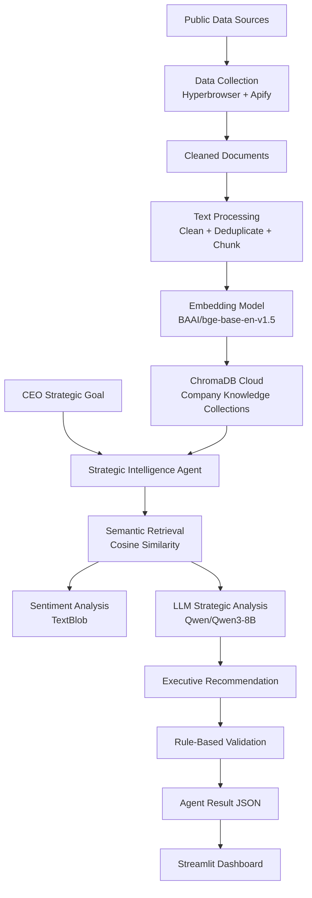
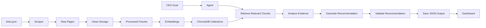

# AI CEO: Strategic Intelligence Agent

> NLP Final Project — SRH University of Applied Sciences Heidelberg  


## Overview

**AI CEO** is an AI-powered Strategic Intelligence Agent designed to help airline executives make data-driven strategic decisions.

The system collects information from public company, news, and community sources, processes the content into a searchable vector knowledge base, and uses retrieval-augmented reasoning to generate executive-level insights, risks, opportunities, and recommendations.

It is built as one end-to-end AI intelligence workflow: source collection, document processing, embedding, retrieval, reasoning, validation, and dashboard visualization work together to support strategic decision-making.

---

## Key Features

- Collects airline intelligence from multiple public sources.
- Cleans, deduplicates, chunks, and embeds collected documents.
- Stores company-specific knowledge in ChromaDB Cloud collections.
- Retrieves relevant evidence using semantic similarity search.
- Uses an LLM to generate strategic analysis and recommendations.
- Performs rule-based recommendation validation.
- Provides sentiment analysis over retrieved evidence.
- Displays outputs in a Streamlit executive dashboard.
- Saves every agent run as structured JSON for auditability.

---

## Table of Contents

- [Overview](#overview)
- [Key Features](#key-features)
- [System Architecture](#system-architecture)
- [Data Flow](#data-flow)
- [AI Pipeline](#ai-pipeline)
- [Technology Stack](#technology-stack)
- [Project Structure](#project-structure)
- [Setup](#setup)
- [Running the Project](#running-the-project)
- [Example CEO Questions](#example-ceo-questions)
- [Companies Covered](#companies-covered)
- [Output Format](#output-format)
- [Design Decisions](#design-decisions)

---

## System Architecture



### Main Components

| Component | File | Role |
|---|---|---|
| Pipeline Runner | `run_pipeline.py` | Builds and refreshes the knowledge base |
| Scraper | `scraper_1.py` | Scrapes public URLs using Hyperbrowser |
| Review Scraper | `review_scraper.py` | Optionally collects Skytrax reviews using Apify |
| Document Cleaner | `clean_storage.py` | Cleans, deduplicates, and stores raw documents |
| Processor | `processor.py` | Cleans text and creates document chunks |
| Embedder | `embedder.py` | Generates BGE embeddings |
| Vector Store | `vector_store.py` | Handles ChromaDB read/write operations |
| Agent | `agent.py` | Retrieves evidence, analyzes, recommends, and validates |
| Dashboard | `dashboard.py` | Displays insights through Streamlit |
| Config | `config.py` | Stores model settings, paths, and collection mapping |

---

## Data Flow



### End-to-End Workflow

The project follows one continuous intelligence workflow:

1. `links.json` provides seed URLs for each airline.
2. `scraper_1.py` scrapes public pages using Hyperbrowser.
3. `review_scraper.py` can optionally collect Skytrax reviews using Apify.
4. `clean_storage.py` removes noisy HTML, deduplicates content, and stores cleaned documents.
5. `processor.py` cleans and chunks documents into approximately 500-word passages.
6. `embedder.py` generates 768-dimensional embeddings using `BAAI/bge-base-en-v1.5`.
7. `vector_store.py` stores embeddings in company-specific ChromaDB Cloud collections.
8. `agent.py` embeds the CEO goal and retrieves the most relevant evidence from ChromaDB.
9. TextBlob calculates sentiment over retrieved evidence.
10. Qwen/Qwen3-8B generates strategic analysis and an executive recommendation.
11. A rule-based validator checks recommendation quality.
12. Results are saved as JSON and visualized in the Streamlit dashboard.

---

## AI Pipeline

### 1. Collection

```text
links.json → scraper_1.py → raw pages per company → clean_storage.py
```

The project collects public intelligence from company sources, news sources, and community sources.

### 2. Processing

```text
clean documents → processor.py → cleaned chunks
```

Documents are cleaned, deduplicated, and split into approximately 500-word chunks. Each chunk is tagged with the relevant airline company.

### 3. Embedding

```text
chunks → embedder.py → 768-dimensional semantic vectors
```

The project uses `BAAI/bge-base-en-v1.5` to convert chunks into semantic embeddings.

### 4. Vector Storage

```text
embedded chunks → vector_store.py → ChromaDB Cloud
```

Each airline has its own ChromaDB collection for precise retrieval.

### 5. Retrieval

```text
CEO goal → query embedding → ChromaDB search → ranked evidence chunks
```

The agent searches every company collection and ranks companies based on the similarity score of their best matching chunks.

### 6. Sentiment Analysis

```text
retrieved chunks → TextBlob polarity → Positive / Neutral / Negative label
```

Sentiment analysis provides a quick signal about the tone of retrieved evidence.

### 7. Strategic Analysis

```text
retrieved evidence → Qwen/Qwen3-8B → findings, risks, opportunities, decision
```

The LLM reads the retrieved evidence and produces structured strategic analysis.

### 8. Recommendation

```text
CEO goal + analysis → Qwen/Qwen3-8B → executive recommendation
```

The recommendation contains priority, expected impact, supporting evidence, risk if ignored, and confidence score.

### 9. Validation

```text
recommendation → rule-based quality checks → passed / failed
```

The validator checks whether the recommendation is sufficiently detailed and evidence-supported.

---

## Technology Stack

| Layer | Component | Technology | Purpose |
|---|---|---|---|
| Data Collection | Scraper | `scraper_1.py` + Hyperbrowser | Scrapes URLs from `links.json` per company |
| Data Collection | Review Scraper | `review_scraper.py` + Apify | Optional Skytrax airline reviews |
| Raw Storage | Document Store | `clean_storage.py` + JSON | Stores cleaned and deduplicated documents |
| Processing | Text Processor | `processor.py` | Cleans, deduplicates, and chunks text |
| Embedding | Embedding Model | `BAAI/bge-base-en-v1.5` | Converts text into 768-dimensional semantic vectors |
| Vector Storage | Vector Database | ChromaDB Cloud | Stores company-specific vector collections |
| Retrieval | Semantic Search | Cosine Similarity | Ranks chunks by relevance to the CEO goal |
| Sentiment | Sentiment Analysis | TextBlob | Produces polarity scores for retrieved chunks |
| Reasoning | LLM | Qwen/Qwen3-8B | Generates analysis and recommendations |
| Orchestration | Agent | `agent.py` | Coordinates retrieval, reasoning, validation, and output |
| Presentation | Dashboard | Streamlit | Displays executive intelligence results |
| Configuration | Config | `config.py` | Stores collection maps, file paths, and model settings |
| Runtime | Language | Python 3.10 | Main programming language |

---

## Project Structure

```text
NLP_Final_Project/
├── run_pipeline.py          # Pipeline runner: scrape → process → embed → store
├── agent.py                 # Strategic agent: retrieve → analyze → recommend → validate
├── dashboard.py             # Streamlit executive intelligence dashboard
├── config.py                # Collection map, model settings, and file paths
├── scraper_1.py             # Hyperbrowser web scraper
├── review_scraper.py        # Optional Apify Skytrax review scraper
├── clean_storage.py         # Document builder, deduplication, and JSON storage
├── processor.py             # Text cleaning and chunking
├── embedder.py              # BAAI/bge-base-en-v1.5 embedding wrapper
├── vector_store.py          # ChromaDB read/write operations
├── links.json               # Seed URLs per company and scrape depth
├── outputs/
│   └── agent_results/       # JSON outputs from each agent run
└── README.md
```

---

## Setup

### 1. Clone the Repository

```bash
git clone <your-repository-url>
cd NLP_Final_Project
```

### 2. Create a Virtual Environment

```bash
python -m venv .venv
```

Activate it:

```bash
# macOS / Linux
source .venv/bin/activate
```

```powershell
# Windows PowerShell
.venv\Scripts\Activate.ps1
```

### 3. Install Dependencies

If your project includes a `requirements.txt` file, install dependencies with:

```bash
pip install -r requirements.txt
```

If no `requirements.txt` file exists yet, install the required libraries used by your project, including Streamlit, ChromaDB, TextBlob, and the embedding/LLM client dependencies.

### 4. Configure Environment Variables

Set your HuggingFace token before running the agent.

```powershell
# Windows PowerShell
$env:HF_TOKEN="your_hf_token_here"
```

```bash
# macOS / Linux
export HF_TOKEN="your_hf_token_here"
```

Configure any additional API keys required by your scrapers, such as Hyperbrowser, Apify, or ChromaDB credentials, according to your `config.py` setup.

---

## Running the Project

### Step 1: Build the Knowledge Base

Run the full data pipeline:

```bash
python run_pipeline.py
```

Skip scraping if data was already collected:

```bash
python run_pipeline.py --skip-scrape
```

Include Skytrax reviews:

```bash
python run_pipeline.py --reviews
```

### Step 2: Run the Strategic Agent

```bash
python agent.py --goal "Should Lufthansa invest in expanding transatlantic routes given current competitor positioning?"
```

### Step 3: Launch the Dashboard

```bash
streamlit run dashboard.py --server.port 8501
```

Open the Streamlit URL shown in your terminal to view the executive dashboard.

---

## Example CEO Questions

- Should Lufthansa invest in expanding transatlantic routes given current competitor positioning?
- What are the biggest operational risks Lufthansa faces compared to Delta Air Lines and United Airlines?
- How should Lufthansa respond to low-cost carriers capturing short-haul European market share?
- Which emerging technologies should Lufthansa prioritize to improve customer experience and reduce operational costs?
- Should Lufthansa pursue strategic partnerships or acquisitions to strengthen its Asia-Pacific position?

---

## Companies Covered

| Company | ChromaDB Collection |
|---|---|
| Lufthansa | `Lufthansa_Knowledge` |
| Air India | `AirIndia_Knowledge` |
| United Airlines | `UnitedAirlines_Knowledge` |
| Delta Air Lines | `DeltaAirlines_Knowledge` |
| American Airlines | `AmericanAirlines_Knowledge` |
| Reviews | `Reviews_Knowledge` optional review collection |

---

## Dashboard Sections

The Streamlit dashboard renders seven executive intelligence sections:

1. Company Overview
2. Market Intelligence
3. Opportunity Monitor
4. Risk Monitor
5. Sentiment Analysis
6. Recommendations
7. CEO View

---

## Output Format

Each agent run is saved in:

```text
outputs/agent_results/agent_YYYYMMDD_HHMMSS.json
```

Example output structure:

```json
{
  "agent_run_id": "agent_20260629_153000",
  "ceo_goal": "Should Lufthansa invest in expanding transatlantic routes?",
  "generated_at": "2026-06-29T15:30:00Z",
  "retrieval_summary": {
    "focus_companies": [],
    "investigation_topics": [],
    "primary_concern": "",
    "rationale": "",
    "total_chunks": 0
  },
  "analysis": {
    "key_findings": [],
    "risks": [],
    "opportunities": [],
    "decision": "monitor",
    "confidence_score": 0
  },
  "recommendation": {
    "recommendation": "",
    "priority": "Medium",
    "expected_impact": "",
    "supporting_evidence": [],
    "risk_if_ignored": "",
    "confidence_score": 0
  },
  "validation": {
    "passed": false,
    "issues": [],
    "validated_at": ""
  },
  "sentiment": {
    "average_score": 0,
    "label": "Neutral",
    "chunk_scores": []
  }
}
```

---

## Design Decisions

### Per-Company ChromaDB Collections

Each airline has its own ChromaDB collection, such as `Lufthansa_Knowledge` or `DeltaAirlines_Knowledge`. This keeps retrieval focused, makes company-level comparison easier, and allows new companies to be added without restructuring the full database.

### Embedding-Driven Retrieval

The agent embeds the CEO goal directly and searches all company collections. This avoids relying on the LLM to decide what to retrieve, reducing malformed planning outputs and improving retrieval consistency.

### BAAI/bge-base-en-v1.5 Embeddings

`BAAI/bge-base-en-v1.5` is used because it performs well for asymmetric retrieval, where a short query retrieves longer document passages. It produces 768-dimensional embeddings suitable for semantic search.

### ChromaDB Cloud over FAISS

ChromaDB Cloud provides persistent hosted vector storage, which is useful in environments where local disk may be temporary. It also provides a simple Python API for upsert, search, and count operations.

### Qwen/Qwen3-8B for Reasoning

Qwen/Qwen3-8B is used for structured strategic analysis and recommendation generation through the HuggingFace Router API. The agent strips any `<think>...</think>` sections and extracts the final JSON output.

### Rule-Based Validation

The validation step uses deterministic checks instead of another LLM call. It verifies confidence score, supporting evidence count, and recommendation length.

### Unified Pipeline Design

The project is presented as a single strategic intelligence workflow rather than two separate systems. Data collection, processing, retrieval, reasoning, validation, and dashboard visualization are connected through clear scripts and shared outputs, making the project easier to understand, demonstrate, and maintain.

---

## Notes

- Re-run `python run_pipeline.py` whenever the knowledge base needs to be refreshed.
- Use `--skip-scrape` when scraped data already exists.
- Use `--reviews` to include optional Skytrax review data.
- Ensure all required API keys are configured before running the pipeline.

---

## License

Add your project license here if required.
